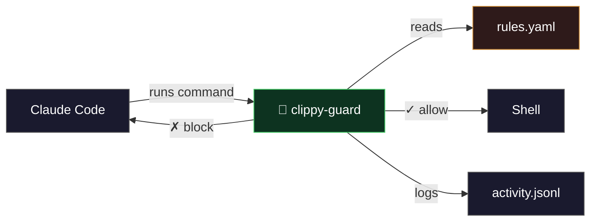
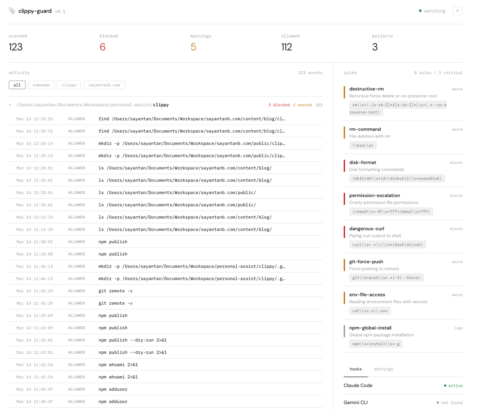

<p align="center">
  <h1 align="center">📎 clippy-guard</h1>
  <p align="center">
    Terminal guardian.<br>
    Blocks dangerous commands. Warns on risky ones. Logs everything.<br>
    Currently supports <strong>Claude Code</strong>.
  </p>
  <p align="center">
    <a href="https://www.npmjs.com/package/clippy-guard"></a>
    <a href="https://www.npmjs.com/package/clippy-guard"></a>
    <a href="https://github.com/sayantan94/clippy/blob/main/LICENSE"></a>
    <a href="https://nodejs.org"></a>
  </p>
</p>

---

## Blog 
https://www.sayantan.sh/blog/clippy

## Why

AI coding agents run arbitrary shell commands. Most of the time that's fine. Sometimes it's `rm -rf /`, `chmod 777`, or `curl | bash`.

clippy-guard sits between the agent and your shell, checking every command against your rules before it executes.

- **Zero dependencies.** Single hook script.
- **Plain YAML rules.** Edit and they apply instantly.
- **Per-project overrides.** Drop `.clippy/rules.yaml` in any project.
- **Full audit trail.** Every command logged with project, session, and timestamp.
- **Web dashboard.** Visual monitoring with live stats.

## Quick start

```bash
npx clippy-guard init
```

That's it. clippy-guard will:

1. Create `~/.clippy/` with default rules and the hook script
2. Configure the `PreToolUse` hook in Claude Code's global settings

Every Claude Code session across all your projects is now guarded.

## How it works



1. Claude Code tries to run a shell command
2. The `PreToolUse` hook pipes the command to clippy-guard
3. clippy-guard matches it against your rules
4. **Critical** → blocked, agent gets error feedback
5. **Warning** → allowed, logged
6. **Info** → allowed, silently logged

```
Claude: "I'll run rm -rf /tmp/important-data"
  → 🚨 CLIPPY BLOCKED: Recursive force delete or no-preserve-root
  →    This action has been blocked by clippy-guard safety rules.
  →    Edit rules: ~/.clippy/rules.yaml

Claude: "Running git push --force origin main"
  → ⚠️  CLIPPY WARNING: Force push detected
  → Command runs, but it's logged
```

## Install

**Requirements:** Node.js 18+, `jq` (`brew install jq` on macOS)

```bash
# Install globally
npm install -g clippy-guard

# Or run directly
npx clippy-guard init
```

## Commands

| Command | Description |
|---------|-------------|
| `clippy-guard init` | Install hooks in Claude Code |
| `clippy-guard status` | Show hook status and stats |
| `clippy-guard rules` | List active rules |
| `clippy-guard log [n]` | Show recent activity (default: 20) |
| `clippy-guard dashboard` | Open the web dashboard |
| `clippy-guard cleanup` | Remove hooks and clear activity log |

If not installed globally, prefix with `npx`.

## Rules

Rules live in `~/.clippy/rules.yaml`. Edit this file to customize.

```yaml
rules:
  - name: destructive-rm
    pattern: "rm\\s+(-[a-zA-Z]*f[a-zA-Z]*\\s+|.*--no-preserve-root)"
    severity: critical
    description: "Recursive force delete or no-preserve-root"

  - name: git-force-push
    pattern: "git\\s+push\\s+.*(-f|--force)"
    severity: warning
    description: "Force pushing to remote"

  - name: npm-global-install
    pattern: "npm\\s+install\\s+-g"
    severity: info
    description: "Global npm package installation"
```

**Changes take effect immediately** — the hook reads the file on every command.

### Per-project overrides

Drop a `.clippy/rules.yaml` in any project directory to override the global rules for that project. When a local rules file exists, it takes full precedence over the global one.

```
my-project/
├── .clippy/
│   └── rules.yaml    ← used instead of ~/.clippy/rules.yaml
└── ...
```

### Severity levels

| Severity | Behavior | Exit code |
|----------|----------|-----------|
| `critical` | **Blocks** the command. Agent sees error feedback. | 2 |
| `warning` | **Warns** but allows execution. Logged. | 0 |
| `info` | **Logs** silently. | 0 |

### Patterns

Patterns are extended regex (ERE), matched with `grep -E`.

```yaml
# Block deleting home directory
- name: rm-home
  pattern: "rm\\s+.*(/Users/|\\$HOME)"
  severity: critical
  description: "Deleting files in home directory"

# Warn on Docker system prune
- name: docker-prune
  pattern: "docker\\s+system\\s+prune"
  severity: warning
  description: "Docker system prune"

# Log all pip installs
- name: pip-install
  pattern: "pip3?\\s+install"
  severity: info
  description: "Python package installation"
```

### Default rules

| Rule | Severity | Catches |
|------|----------|---------|
| `destructive-rm` | warning | `rm -rf`, `rm -f`, `--no-preserve-root` |
| `rm-command` | warning | Any `rm` command |
| `disk-format` | critical | `mkfs`, `dd if=`, `diskutil eraseDisk` |
| `permission-escalation` | critical | `chmod 777`, `chmod -R 777` |
| `dangerous-curl` | critical | `curl ... \| bash` |
| `git-force-push` | warning | `git push --force`, `git push -f` |
| `env-file-access` | warning | `cat .env` |
| `npm-global-install` | info | `npm install -g` |

## Dashboard

```bash
npx clippy-guard dashboard
```

Opens a web dashboard at `http://localhost:3456` with:

- Activity feed grouped by working directory
- Live stats — scanned, blocked, warnings, allowed
- Rules view with severity and patterns
- Hook status
- Dark / light mode
- Auto-refresh every 3 seconds



Custom port: `CLIPPY_PORT=8080 npx clippy-guard dashboard`

## How hooks work

clippy-guard uses Claude Code's native [hook system](https://docs.anthropic.com/en/docs/claude-code/hooks). No daemons, no binaries, no root access.

The `PreToolUse` hook in `~/.claude/settings.json` intercepts every `Bash` tool call. The command is piped as JSON to `check-command.sh` on stdin:

```json
{
  "session_id": "abc-123",
  "cwd": "/Users/you/project",
  "tool_name": "Bash",
  "tool_input": { "command": "rm -rf /tmp/test" }
}
```

| Exit code | Meaning |
|-----------|---------|
| `0` | Allow |
| `2` | Block (stderr shown to agent) |

## File layout

```
~/.clippy/
├── rules.yaml          # your rules (edit this)
├── check-command.sh    # hook script (auto-generated)
└── activity.jsonl      # audit log (append-only)
```

## Configuration

| Variable | Default | Description |
|----------|---------|-------------|
| `CLIPPY_HOME` | `~/.clippy` | Rules, logs, and hook script directory |
| `CLIPPY_PORT` | `3456` | Web dashboard port |

## Uninstall

```bash
# Remove hooks and clear logs (keeps rules)
npx clippy-guard cleanup

# Remove all clippy-guard data
rm -rf ~/.clippy

# Uninstall if installed globally
npm uninstall -g clippy-guard
```

## License

MIT
